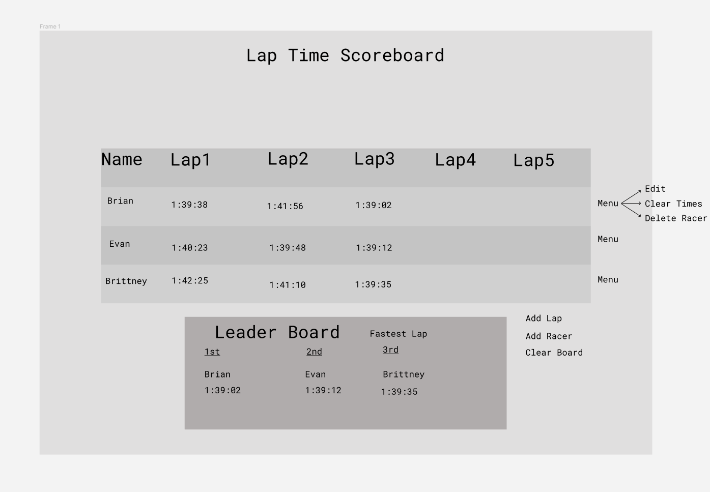

# Lap Time Scoreboard App

## Application concept
### About
- This app is designed to keep track of lap times for you and your friends at any sort of racing event
- The app starts with a bit of base information for demonstration purposes
- The app if full CRUD
    - GET: Get racer info
    - POST: Add new racer
    - PUT: Edit race times, clear race times, add new laps
    - DELETE: Delete a racer

### Functionality
- There will be a header at the top of the page with the title of the app
- When the app loads it should show a scoreboard with some information already populated
- You will be able to:
    - Edit, Clear, and Delete info for each racer
    - Add a new racer
    - Add a new lap
    - Clear all the lap times from the board

### Endpoints
- Get: sends back data from data.js
- POST: adds a new racer to data
- PUT: edits data in one of three ways:
    - may set each index of lap time arrays to empty string for all racers
    - may edit individual lap time on racer
    - may clear each index of lap time arrays to empty string for individual racer
- Delete: deletes racer from data

### Component Architecture
- App.js (Stateful: holds or lap times array)
    - Header.js (Functional)
    - LapBoard.js (Stateful: this.state.lapCount)
        - AddRacer.js (Functional)
    - Racers.js (Functional)
        - EditDelete.js (Stateful: this.state.isEditing, this.state.userInput)

## Wireframe

